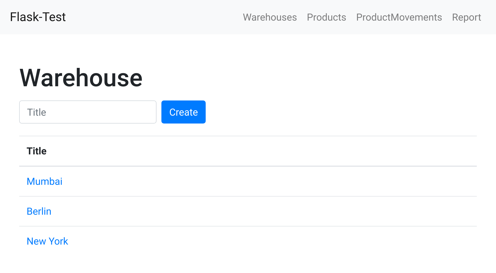
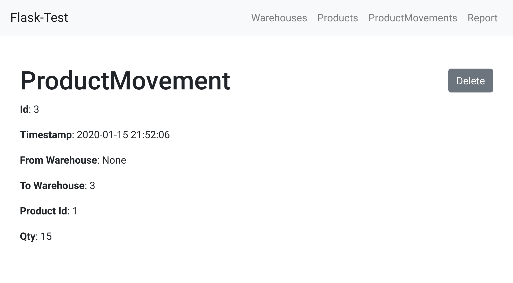

## Frappe Flask-Test

This is my try at Frappe's [Flask Test](https://frappe.io/flask-test). I didn't look at any other solution before writing this. If you did not complete the test yet, I encourage you to try it yourself, before looking at my solution. 

The structure of this app is based on the [Flask Tutorial](https://flask.palletsprojects.com/en/1.1.x/tutorial/). I use [bootstrap's CSS](https://getbootstrap.com/docs/4.4/getting-started/introduction/#css) for styling.


The list of warehouses.


A single product movement.


Report of current stock.

## Setup

Create and activate venv, install dependencies:

```bash
virtualenv venv
source ./venv/bin/activate
pip install -r requirements.txt
export FLASK_APP=flask_test
```

Initialize the database. This will create a database file in the instance directory.

```bash
flask init-db
```

Run the app:

```bash
flask run --reload
```

## Challenges

At first I built a simplified version where you could create items and locations and move each item from one location to another. Later, I refactored this and added the ability to move quantities of a product between locations. At the very end I added the report over the quantities available in each location.

I spent way too much time figuring out why the selected `<option>` in a new ProductMovement was not submitted by the browser. My form looked like this:

```html
<form action="{{ url_for('api.create_doc', doc_type=doc_type) }}" method="post" class="form-inline" id="newdoc">
    
        
            <select class="form-control custom-select my-1 mr-sm-2">
                <option value="" disabled selected>{{ field.get('display') }}</option>
                
                    <option value="{{ option['id'] }}">{{ option['title'] }}</option>
                
            </select>
        
            <label for="{{ field.get('name') }}-field" class="sr-only">{{ field.get('display') }}</label>
            <input 
                type="{{ field.get('type') }}"
                name="{{ field.get('name') }}"
                id="{{ field.get('name') }}-field"
                placeholder="{{ field.get('display') }}"
                class="form-control my-1 mr-sm-2"
            >
        
    
    <button type="submit" class="btn btn-primary my-1">Create</button>
</form>
```

But when I klicked the submit button, the browser didn't send any value to the server. I found the solution by making a simplified version of the problem, without the distracting jinja and bootstrap:

```html
<select>
    <option value="1">Option 1</option>
    <option value="2">Option 2</option>
</select>
```

The solution was very simple: the `<select>` field needs a name, so the browser can send `my_field=1` to the server.

```html
<select name="my_field">
    <option value="1">Option 1</option>
    <option value="2">Option 2</option>
</select>
```
